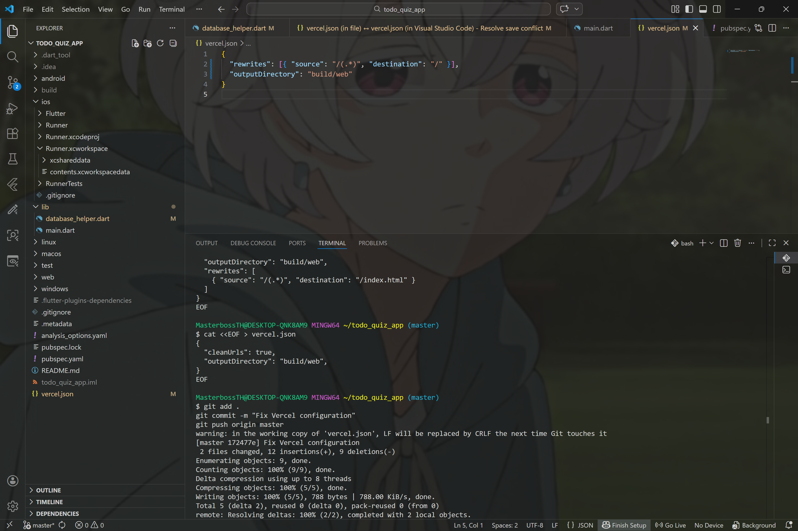

# todo_quiz_app

โครงการนี้เป็นส่วนหนึ่งของวิชาการพัฒนาแอปพลิเคชันบนอุปกรณ์เคลื่อนที่ (Mobile Native Subject) โดยมีวัตถุประสงค์เพื่อพัฒนาแอปพลิเคชันประเภท To-Do List สำหรับการจัดการกิจกรรมต่าง ๆ โดยใช้ Flutter Framework

## 📸 Preview ผมทำด้วยตนเอง ลองถูกผิดพึ่งตนเองสุดความสามารถเเล้วครับ เเต่deployเว็ปไม่ขึ้นครับ


## 📸 Preview ผมทำด้วยตนเอง ลองถูกผิดพึ่งตนเองสุดความสามารถเเล้วครับ เเต่deployเว็ปไม่ขึ้นครับ


## 🛠 Features (ฟีเจอร์ของแอป)
*   **Create Task:** สามารถเพิ่มรายการสิ่งที่ต้องทำได้
*   **Manage Task:** สามารถตรวจสอบสถานะงานที่เสร็จสิ้นแล้ว
*   **Responsive UI:** ออกแบบหน้าจอให้รองรับการใช้งานบนอุปกรณ์ต่างๆ

## 🚀 Getting Started (วิธีการรันโปรเจกต์)
สำหรับผู้ที่ต้องการตรวจสอบโค้ด สามารถรันผ่าน Flutter SDK ได้ตามขั้นตอนดังนี้:

1. **Clone project:**
   ```bash
   git clone https://github.com/oqwhitecat/todo_quiz_app.git
   cd todo_quiz_app

2. **Install dependencies:**
   flutter pub get

3. **Run application:**
   flutter run
